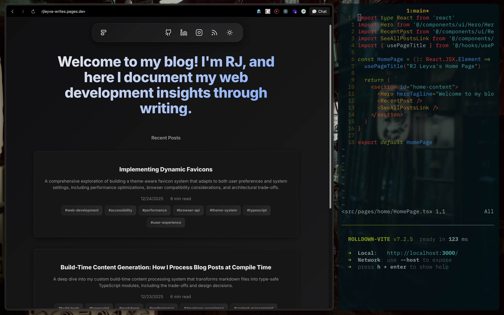
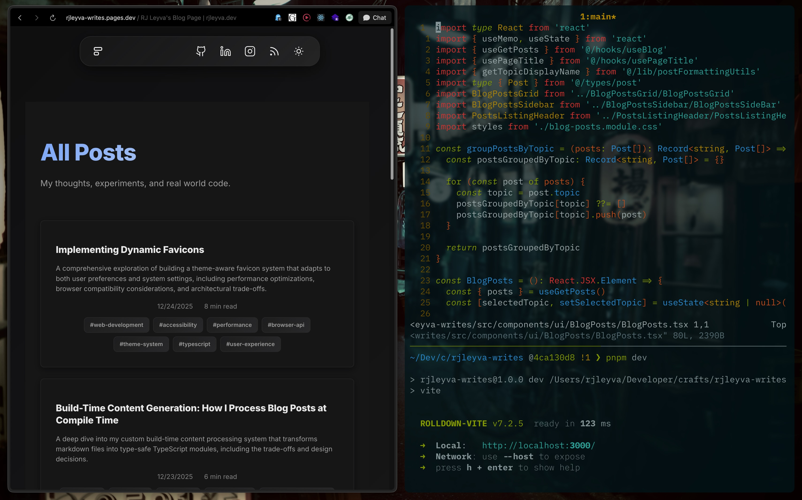
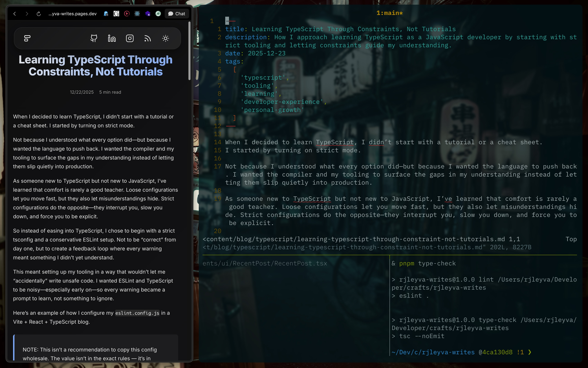

# rjleyva-writes (WIP)

RJ Leyva's personal blog, documenting web development insights through writing.

---

## Current Status

### Home Page



### Blog Page



### Post



## Tech Stack

### Core Framework & Language

- **React 19.2.0** with React Compiler (babel-plugin-react-compiler)
- **TypeScript 5.9.3** with strict type checking
- **Vite 7.2.5** (Rolldown) for fast development and optimized builds

### Routing & State Management

- **React Router v7** (data-mode) for client-side routing
- Context API for theme management with localStorage persistence

### Content Processing

- **Unified** ecosystem for markdown processing:
  - `remark-parse` + `remark-gfm` for GitHub Flavored Markdown
  - `remark-rehype` for HTML conversion
  - `rehype-react` for React component rendering
  - `rehype-slug` for heading anchors
  - `rehype-sanitize` for content security

### Styling & UI

- **CSS Modules** with BEM methodology for scoped styling
- **CSS custom properties** for dynamic theming (dark/light modes)
- **Modern Normalize** for consistent cross-browser styling
- Responsive design with mobile-first approach

### Development Tools

- **ESLint 9** with React-specific rules and accessibility plugins
- **Prettier 3.7.3** with import sorting (ianvs/prettier-plugin-sort-imports)
- **tsx** for TypeScript execution in build scripts
- **Bundle analyzer** for build optimization insights

### Build & Deployment

- **Cloudflare Pages** for global CDN deployment
- **Wrangler** for Cloudflare integration
- Automated content generation and RSS feed creation
- Optimized chunk splitting for vendor libraries

## Features

### 🎨 Theme System

- Dark/Light theme toggle with system preference detection
- Automatic favicon switching based on theme
- Smooth theme transitions with CSS custom properties
- Persistent theme selection in localStorage

### 📝 Content Management

- Markdown-based blog posts with YAML frontmatter
- Topic-based content organization (`/blog/:topic/:slug`)
- Automatic reading time estimation (200 WPM)
- Frontmatter validation with helpful error messages
- Build-time content import generation

### 🚀 Performance & DX

- React Compiler for optimized re-renders
- Lazy loading for blog pages and components
- Code splitting for vendor libraries (React, markdown processing)
- Bundle analysis and optimization
- Hot module replacement during development

### 🔧 Developer Experience

- Strict TypeScript configuration
- Comprehensive ESLint rules with React and accessibility plugins
- Prettier with automatic import sorting
- Error boundaries for graceful error handling
- Build-time content validation and generation

### 📱 User Experience

- Responsive design for all screen sizes
- Copy-to-clipboard functionality for code blocks
- SEO-friendly URLs and meta tags
- Accessible navigation and keyboard support
- Loading states and error handling

### 📡 Content Syndication

- Automated RSS feed generation (XML + HTML preview)
- Social media links (GitHub, LinkedIn, Instagram)
- Structured data for better SEO
- Sitemap and robots.txt generation

## Project Structure

```
src/
├── components/           # Reusable UI components
│   ├── ui/              # Core UI components (Header, BlogCard, etc.)
│   ├── icons/           # SVG icon components
│   └── RouteErrorBoundary/
├── content/             # Blog content in Markdown
│   └── blog/            # Topic-organized blog posts
├── contexts/            # React context providers
├── hooks/               # Custom React hooks
├── layouts/             # Page layout components
├── lib/                 # Business logic and utilities
│   ├── content/         # Content processing and validation
│   └── blogContentApi.ts
├── pages/               # Route-specific page components
├── routes/              # React Router configuration
├── services/            # External service integrations
├── styles/              # Global styles and theme variables
├── types/               # TypeScript type definitions
└── utils/               # Utility functions
```

## Content System

Blog posts are written in Markdown with YAML frontmatter:

```yaml
---
title: 'My Blog Post'
date: '2025-12-05'
description: 'A brief description of the post content'
tags: ['javascript', 'react', 'tutorial']
---
# Post Content

Your markdown content here...
```

### Frontmatter Fields

- `title` (required): Post title
- `date` (required): Publication date (ISO format)
- `description` (required): SEO description and RSS summary
- `tags` (optional): Array of topic tags

### Content Organization

Posts are organized by topic in `src/content/blog/`:

```
src/content/blog/
├── css/
│   └── styling-techniques.md
├── javascript/
│   └── modern-patterns.md
└── react/
    └── component-design.md
```

URLs follow the pattern: `/blog/{topic}/{slug}`

## Development

### Prerequisites

- Node.js 18+
- pnpm

### Installation

```bash
pnpm install
```

### Development Server

```bash
pnpm dev
```

Starts the development server at `http://localhost:3000`

### Build Commands

```bash
# Development build
pnpm build

# Production build with linting and type checking
pnpm build:production

# Preview production build
pnpm preview
```

### Content Generation

The build process automatically generates:

- TypeScript imports for all blog content
- RSS feed (XML and HTML preview)
- Reading time calculations
- Content validation

### Quality Checks

```bash
# Lint code
pnpm lint

# Fix linting issues
pnpm lint:fix

# Format code
pnpm format

# Type check
pnpm type-check
```

## Deployment

Deployed on **Cloudflare Pages** with:

- Global CDN distribution
- Automatic HTTPS
- Build optimization for performance
- Custom headers and redirects

## License

MIT License.

> **Content Notice:** The blog posts in `src/content/blog/` are original content. Please do not copy or reuse them without proper attribution and permission.
